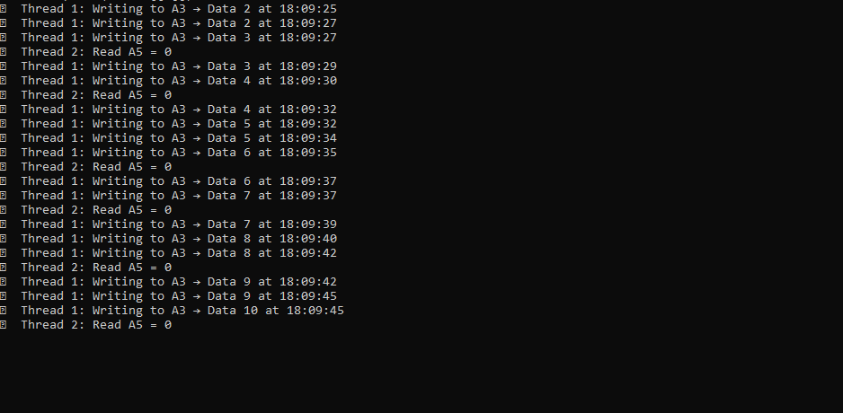
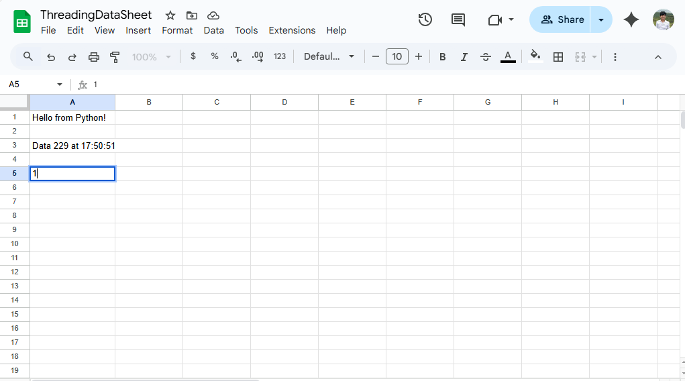
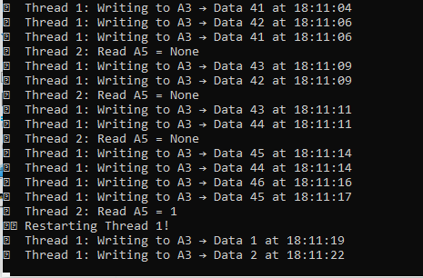

# 🧠 SheetSync Controller

SheetSync Controller is a Python-based multithreaded system that demonstrates how to control or monitor processes using Google Sheets as a shared interface. This project uses Google Sheets as a medium for communication between two threads, simulating how different parts of a system might signal and respond to each other.

---

## 🚀 Features

- 🧵 Two parallel Python threads:
  - **Thread 1:** Writes to the sheet at regular intervals.
  - **Thread 2:** Reads from a cell and triggers an action based on the value.
- ☁️ Real-time integration with **Google Sheets** via `gspread`.
- 🔁 Simple simulation of an I/O or control mechanism.

---
## 📸 Screenshots

### 🔁 Live Output in Terminal


### 📊 Google Sheet Interaction


### 🔁 Thread Restart 


## 📁 File Structure

```
.
├── credentials.json          # Google service account credentials
├── threading_gsheet.py       # Main Python script with multi-threading
├── test_sheet.py             # Initial test script to verify Sheet access
├── README.md                 # Project documentation
```

---

## 🔧 Setup Instructions

### 1. Clone the Repo

```bash
git clone https://github.com/your-username/sheetsync-controller.git
cd sheetsync-controller
```

### 2. Install Required Libraries

```bash
pip install gspread oauth2client
```

### 3. Set Up Google Service Account

1. Go to [Google Cloud Console](https://console.cloud.google.com/).
2. Create a new project (or use existing).
3. Enable:
   - **Google Sheets API**
   - **Google Drive API**
4. Create a **Service Account**, generate a key as a JSON file.
5. Rename this JSON key to `credentials.json` and place it in your project folder.
6. Share your Google Sheet with the **client email** in your credentials.json.

### 4. Create Google Sheet

- Create a new Google Sheet.
- Rename it to: `ThreadingDataSheet` (or match with what you open in code).
- Add any value to cells `A3` and `A5` initially.

---

## ▶️ How to Run

### To test sheet connection:

```bash
python test_sheet.py
```

### To run threaded sheet interaction:

```bash
python threading_gsheet.py
```

---

## 🧠 How It Works

- **Thread 1:** Writes a value to `A3` every few seconds.
- **Thread 2:** Monitors cell `A5`. If it reads `"1"`, it triggers a restart of Thread 1.
- Uses Google Sheets as a signaling interface between two independent threads.

---

## 💡 Use Cases

- Simulate a cloud-based command system.
- Learn threading and cloud API interactions.
- Create a lightweight interface for triggering Python actions remotely.

---

## 🛠 Future Enhancements

- Add timestamp logging to the sheet.
- Use Flask + ngrok to trigger updates via web requests.
- Add LED/buzzer simulation on event trigger (for hardware expansion).

---

## 🤝 Contributing

Contributions are welcome! Open an issue or submit a pull request if you have improvements.

---


## 🧑‍💻 Author

Built by [Pratik Halnor] — for Sunshine Powertronics internship submission.
